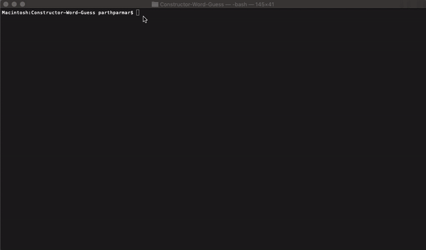

# Constructor-Word-Guess

## Objective

The objective of this app is to allow the user to play a word guess game in the CLI (command line interface).  This game demonstrates use of constructor functions and use of inquirer.

##  Organization

The app is organized in a few different javascript files.
- **main file** -- index.js
    - accepts user input from CLI using Inquirer 
    - check condition on number of guesses left, if the word was guessed correctly or if the letter was previously entered
    - uses the Word construction function to create an object with an array of letter objects and relevant functions to check / process the input from user for each letter object in the array
    - outputs to CLI the word with correct and missing letters, guesses left and game status

- **Word.js** -- read.js
    - defines the Word constructor function used to break work into an array of letter objects
    - two functions to loop through the letter objects to either print the word or check if the letter matches in the word
    - calls on the Letter Constructor function to create letter objects

- **Letter.jse** -- log.js
    - defines the Letter constructor function used to create a letter object containing:
        - the letter it self
        - the status (guessed or not) of the letter
        - function to check if the correct letter was guessed and update the status as needed
        - print the letter correctly or as "_" if status is false (not guessed correctly)

## How to Run

1. clone / fork repo to your computer using git commands
2. run ```npm install``` in CLI to download required node modules to run app
3. navigate to folder with file contents in CLI (e.g. terminal)
4. enter the following line:
    - ```node index.js```
5. select Play Game
6. enter a letter for the given word
7. keep entering letter until the correct word is guessed or you run out of guesses
8. exit or play the game again

## Deployment

link: None

**Local Use Only**

## Technologies Used

- npm: to install required modules
- inquirer: user input 
- constructor functions: to quickly create objects with useful functions that can be quickly accessed when necessary

## Contact

Parth Parmar -- developer of the word guess game using the technologies mentioned above

## Demo

### App Function

